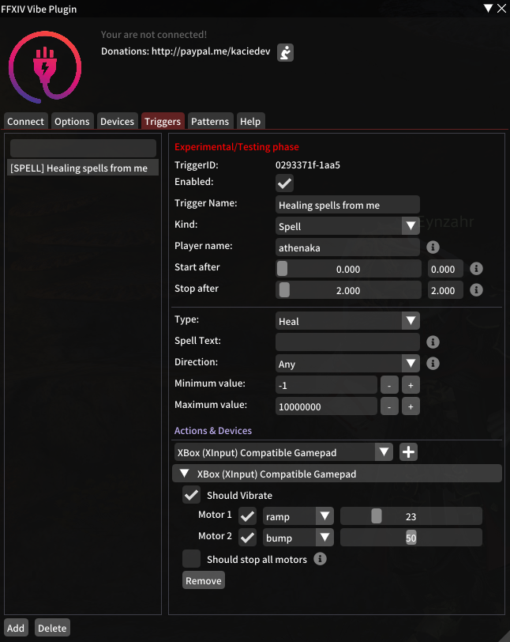

# FFXIV Vibe Plugin

 

  

A plugin for FFXIV that will let you vibe your controller or toys.

## Features
- Easy UI interface.
- Connect your device (manually or automatically).
- Trigger some pattern from chat message.
    - Custom chat selection.
    - Custom allowed characters.
- Trigger some pattern from spells.
    - Custom spell name.
    - Custom spell type (damage, heal...).
    - Custom spell direction (outgoing, incoming, self).
    - Min and/or max dmg/heal values.
    - Custom allowed characters.
- Multiple devices per custom trigger.
- UI to search through your triggers.
- Delay start and stop patterns.
- Custom device and motors.
- Using RegExp for chat messages and spell names.
- Define global threshold or threshold per motor.
- Displaying battery life of devices.
- Custom patterns per motor (save, with easy import, export).
- Vibe or trigger a pattern on HP Changed.
- HP Changed can have custom min/max values or percentages.
- Priority system (lower priority number will be stopped).

\* Limited to 10 free triggers in the free version.

## Premium features
- The number of triggers are unlimited.
- Create multiple profiles.
- Export/Import triggers.

## How to obtain your premium token ?
You need to register on Patreon

## Prerequisites
- [FFXIV QuickLauncher](https://github.com/goatcorp/FFXIVQuickLauncher).
- [Intiface Central](https://intiface.com/central/) **NOT Intiface Desktop**

## Installation
1. Launch your game, open `/xlplugins`, go to the settings (bottom left) and in the `Experimental` tab.
2. Under `Custom Plugin Repositories` add the following url `https://raw.githubusercontent.com/kaciexx/FFXIV_Vibe_Plugin/master/repo.json` and press the <kbd>+</kbd> icon.
3. Press the `Save and close` button on the bottom left.

Now you should be able to see `FFXIV Vibe Plugin`. Click install and enjoy.

## How to use
1. Start `Intiface Central` and click on `Start Server` (top left button). Power on your device, make sure it is connected to Intiface.
2. In the game. Type: `/fvp`. You should see the configuration panel.
3. Press the `Connect` button.

Well done !

You have now FFXIV connected to Intiface. Now you can connect your device to Intiface and you
should be able to use them with FFXIV Vibe Plugin.

## Import triggers
1. Start the game and make sure the plugin is working.
2. On your computer, go to your `%userprofile%` folder (eg: C:\\Users\\<yourname>) folder.
3. The go in the `FFXIV\_Vibe\_Plugin` folder (or create if it does not exists)
4. Add the triggers file you want to import (eg: `MyTrigger.json`)
5. In the plugin go to the `Triggers` tab and click on `Import Triggers` at the bottom.

That's it. It should load all of the triggers.
Note: you can define a custom directory to read/write in the `Options` tab.

## Export triggers
1. On your computre, go to your `%userprofile%` folder (eg: C:\\Users\\<yourname>) folder.
2. Go to the `FFXIV\_Vibe\_Plugin` folder (or create if it does not exists)
3. In the plugin, go to the `Triggers` tab.
4. Create your triggers (if they does not exist).
5. Select the trigger you want to export and click on the `Export` button.

That's it. You should see them in your userprofile directory.
Note: you can define a custom directory to read/write in the `Options` tab.

## USB Dongle vs Lovense Dongle vs Other
We recommend you to use a bluetooth dongle. Here is the one we are using: [TP-Link Nano USB Dongle Bluetooth 5.0](https://www.amazon.fr/gp/product/B09C25VRXD/ref=as_li_tl?ie=UTF8&camp=1642&creative=6746&creativeASIN=B09C25VRXD&linkCode=as2&tag=kaciexx-21&linkId=8b6c8c6e693ab549216c2dacad34e03b)

## Tested devices
- Microsoft XBox Controller
- Lovense (*please use bluetooth and not the lovense dongle*):
    Nora, Hush, Domi, Ferri, Diamo, Edge 2, Gush

## Trigger Packs
You can find some unofficial trigger packs here: [Packs](./Packs/README.md)

## Our TODO
Our current ideas and feedbacks are in: [TODO List](./Docs/TODO.md)

## FAQ

### Troubleshooting
Make sure you have the [intiface-desktop](https://github.com/intiface/intiface-desktop) and not the new Intiface Central.
1. Make sure your toy is not connected to another device (eg: your phone, your browser...). Disable the bluetooth on your phone.
2. Make sure the addon is correctly installed (check the installation process again).
3. Make sure you have the latest version.
4. Upgrade your Intiface by clicking and installing any updates (`Settings` tab).
5. Make sure the Intiface is up and running. Go to `Server status` > `Start Server`. You must have one green icon and one red icon on the top right side of the window.
6. Ingame, make sure the addon is connected to Intiface. Click on `connect` (in the `Connect` tab). Now, go back to Intiface. You should have 2 green icons on the top right side of the window.
7. Ingame, make sure the IP is either `127.0.0.1` or `0.0.0.0` or your real internal IP (eg: 192.168.1.250)
8. Ingame and on Intiface: make sure you are using the same `port` **on both sides**. You can try changing it to something
else **on both sides**.

### My device is not working correctly
Please make sure to test both Bluetooth and the dongle of the device. Choose the one that works best for you.

### My X-Box Controller is not working well
This is not related to this plugin. You probably should not use Bluetooth.

### My Lovense Nora is not doing rotations
Please stop using Lovense Dongle. Connect using the Lovense Connect or bluetooth. If you don't have bluetooth
please buy a bluetooth 5.0 dongle on amazon for 20$.

### The plugin does not connect to Intiface
Please make sure you are doing it right.
Make sure you have the [intiface-desktop](https://github.com/intiface/intiface-desktop) and not the new Intiface Central.
1. Open Intiface and click on the top right side **red** icon.
2. Uncheck everything but not *WebSocket* and *Bluetooth*. WebSocket should have the following text: "on [All Interfaces]:12345"
3. Click on Start Server (now you should have one *green* icon and one *red* icon on the top right side).
4. Go to the plugin and click connect (you should have two *green* icons).
If this is not working: please try change the IP Address to 127.0.0.1 or your computer IP Address. Also make sure the port
is 12345 or correspond to the one in Intiface.

### The device disconnect every now and then.
Please make sure to follow those steps before asking for help:
1. Disable all triggers.
2. Create a new and very simple trigger (eg: vibration on a message). **Make sure it is correctly working**.
3. Wait twice the amount of time needed to have the issue again. (eg: if it was around 30min, then wait 60min or more).

If it works, then it's a trigger issue from one you have created. If not:
1. **Don't stop** the game, **don't stop** Intiface.
2. Turn **off and on** your controller device.
3. Let it reconnect to intiface (without restarting intiface app).
4. Test your trigger again.
If it works, then it probably a bluetooth issue. Nothing we can do about.

### How do I share my configuration
You can use the import and export feature. It will drop the configuration as a file in the desired folder.

### How does the priority system works ?
So regards, the priority system:
- **Trigger A** with priority 10 is triggered and played.
- **Trigger B** with priority 20 is being triggered => **Trigger** A is stop because B has a higher priority.
- **Trigger A** with priority 10 is retriggered => **Trigger A** is ignored because of lower priority, **Trigger B** continues to be played.

### How to stop a pattern
In this example, if you have a pattern that runs for 25 sec:
- Create a new trigger called "Stop Action"
- Define your trigger condition (Spell, chat, ...).
- Add the device(s) you want to stop.
- Set to Intensity and the value to zero for each motor you want to stop.

When the stop trigger is triggered, it will stop your pattern.

*NOTE: make sure the priority is equal or higher than the playing pattern*

# Terms of service

[Terms of service](./TERMS.md)

# Discord
- [This plugin discord](https://discord.gg/JnCGxa3gGa)
- [Ms. Tress #discussion](https://discord.gg/fx5pABsE)

# Donation & Donors
Donation link:
- [https://paypal.me/kaciedev](https://paypal.me/kaciedev)
- [https://www.patreon.com/kaciexx](https://www.patreon.com/kaciexx)

Please concider doing a small donation if you like this plugin. We worked a lot, gave a lots of free nights to design it, listening to everything people wanted and doing the implementation.

Thanks to:
- Hooper (36$)
- Victor (20.70$)
- Maple (20$)
- May B (20$)
- Iris K (20$)
- Morris (9.50$)
- PM (1.90$)
